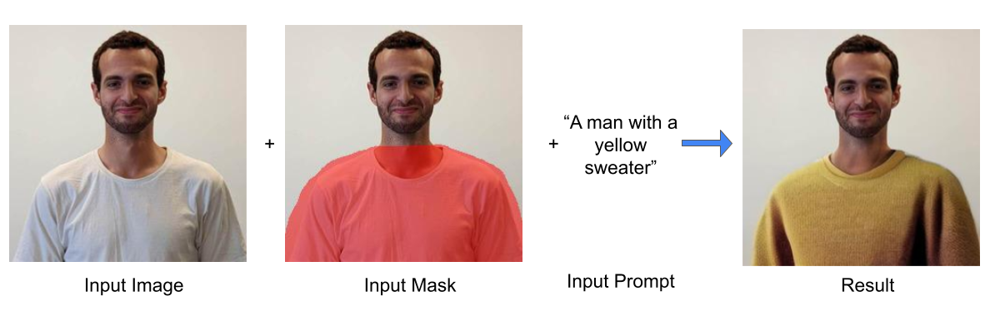
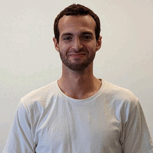
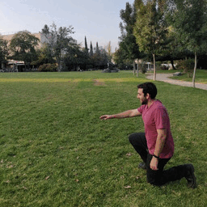
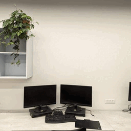
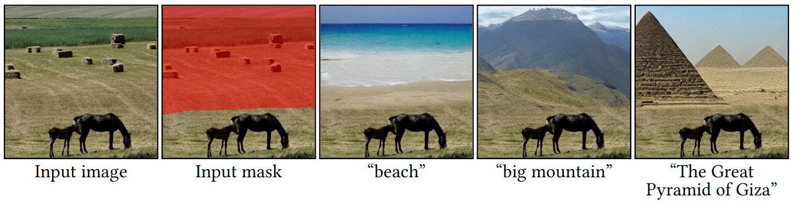
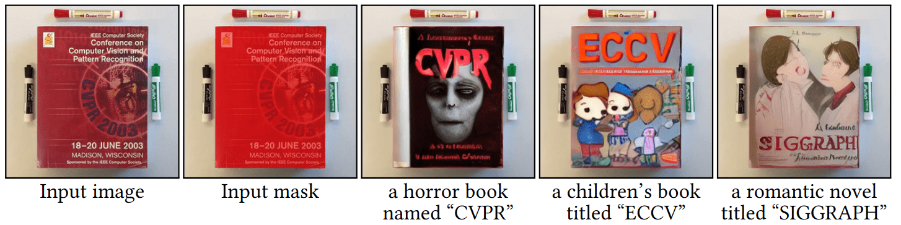
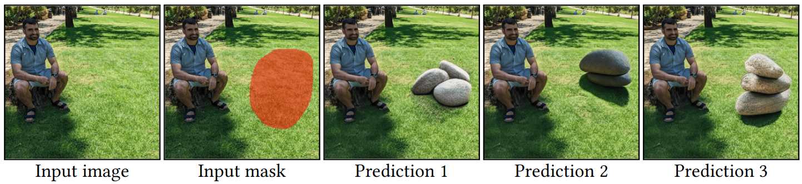
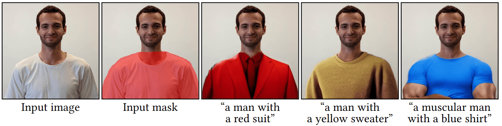
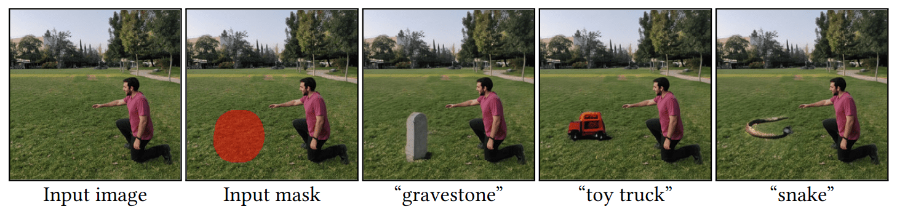
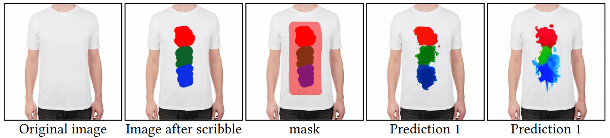

# Blended Latent Diffusion
<a href="https://arxiv.org/abs/2206.02779"></a>
<a href="https://opensource.org/licenses/MIT"></a>
<a href="https://pytorch.org/">=1.7.0-Red?logo=pytorch"></a>

<a href="https://omriavrahami.com/blended-latent-diffusion-page/"></a>

> <a href="https://omriavrahami.com/blended-latent-diffusion-page/">**Blended Latent Diffusion**</a>
>
> Omri Avrahami, Ohad Fried, Dani Lischinski
>
> Abstract: The tremendous progress in neural image generation, coupled with the emergence of seemingly omnipotent vision-language models has finally enabled text-based interfaces for creating and editing images. Handling *generic* images requires a diverse underlying generative model, hence the latest works utilize diffusion models, which were shown to surpass GANs in terms of diversity. One major drawback of diffusion models, however, is their relatively slow inference time. In this paper, we present an accelerated solution to the task of *local* text-driven editing of generic images, where the desired edits are confined to a user-provided mask. Our solution leverages a recent text-to-image Latent Diffusion Model (LDM), which speeds up diffusion by operating in a lower-dimensional latent space. We first convert the LDM into a local image editor by incorporating Blended Diffusion into it. Next we propose an optimization-based solution for the inherent inability of this LDM to accurately reconstruct images. Finally, we address the scenario of performing local edits using thin masks. We evaluate our method against the available baselines both qualitatively and quantitatively and demonstrate that in addition to being faster, our method achieves better precision than the baselines while mitigating some of their artifacts

<div>
  
  
  
</div>

# Applications

### Background Editing


### Text Generation


### Multiple Predictions


### Alter an Existing Object


### Add a New Object


### Scribble Editing


# Installation
Install the conda virtual environment:
```bash
conda env create -f environment.yaml
conda activate ldm
```

Download the pre-trained weights (5.7GB):
```bash
mkdir -p models/ldm/text2img-large/
wget -O models/ldm/text2img-large/model.ckpt https://ommer-lab.com/files/latent-diffusion/nitro/txt2img-f8-large/model.ckpt
```

If the above link is broken, you can use this [Google drive mirror](https://drive.google.com/file/d/1wcOK4co3EnbFAL6UpX1SVChMBKAzkMOx/view?usp=sharing).

# Usage

## Step 1 - Generate initial predictions
```bash
python scripts/text_editing.py --prompt "a pink yarn ball" --init_image "inputs/img.png" --mask "inputs/mask.png"
```

The predictions will be saved in `outputs/edit_results/samples`.

You can use a larger batch size by specifying `--n_samples` to the maximum number that saturates your GPU.

## Step 2 (optional) - Reconstruct the original background
If you want to reconstruct the original image background, you can run the following:
```bash
python scripts/reconstruct.py --init_image "inputs/img.png" --mask "inputs/mask.png" --selected_indices 0 1
```

You can choose the specific image indices that you want to reconstruct. The results will be saved in `outputs/edit_results/samples/reconstructed_optimization`.

# Citation
If you find this useful for your research, please use the following:
```bibtex
@article{avrahami2022blended_latent,
        title={Blended Latent Diffusion},
        author={Avrahami, Omri and Fried, Ohad and Lischinski, Dani},
        journal={arXiv preprint arXiv:2206.02779},
        year={2022}
}
```

# Acknowledgements
This code is based on [Latent Diffusion Models](https://github.com/CompVis/latent-diffusion).